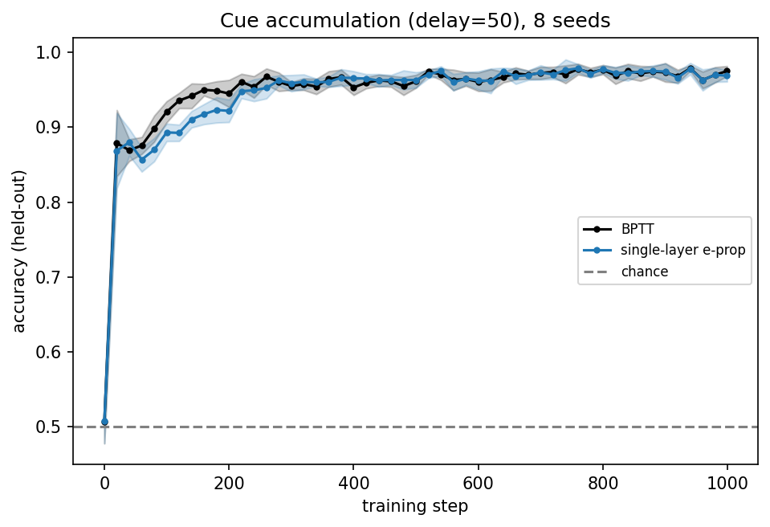
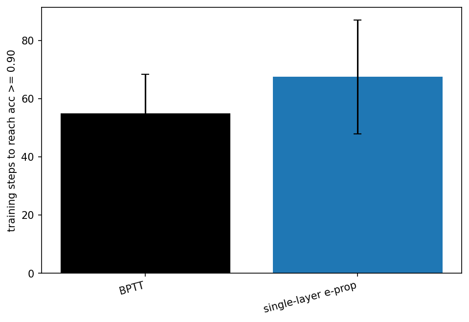
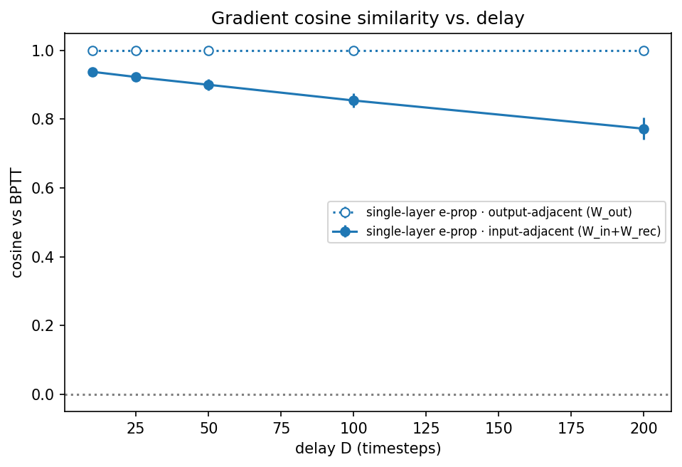
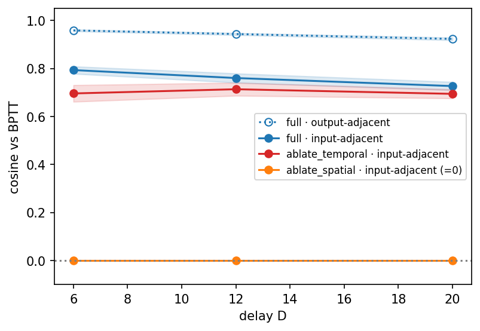
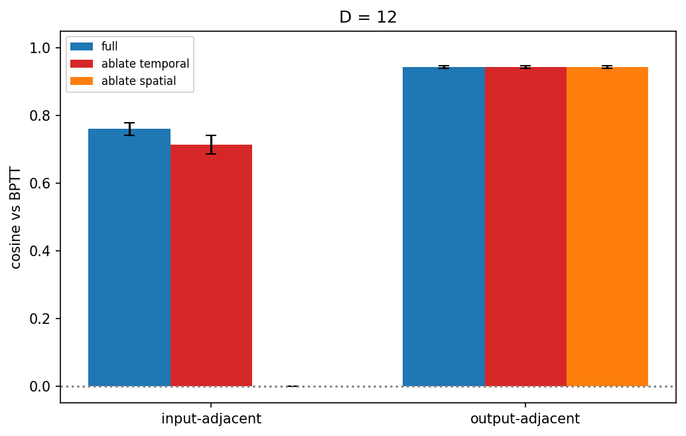
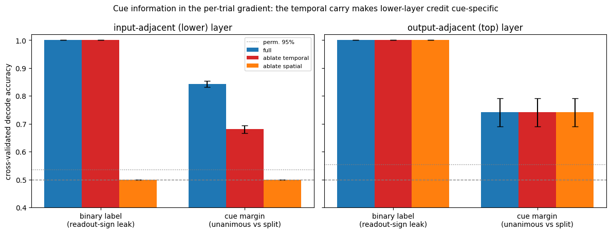
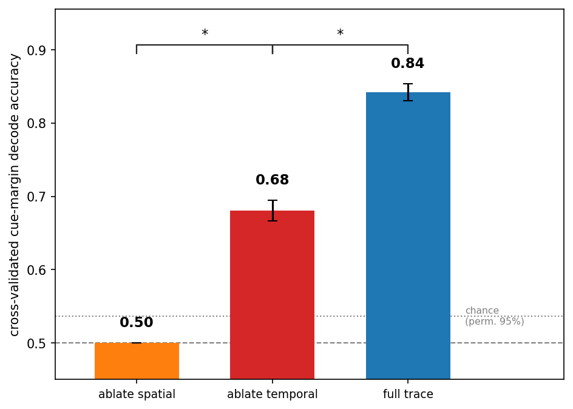
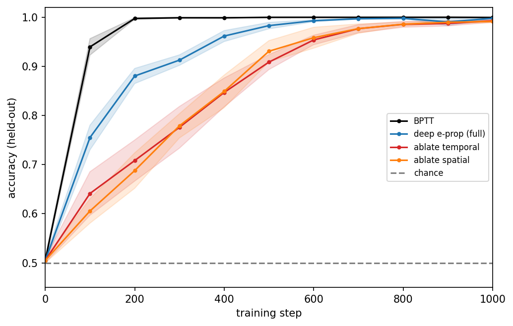
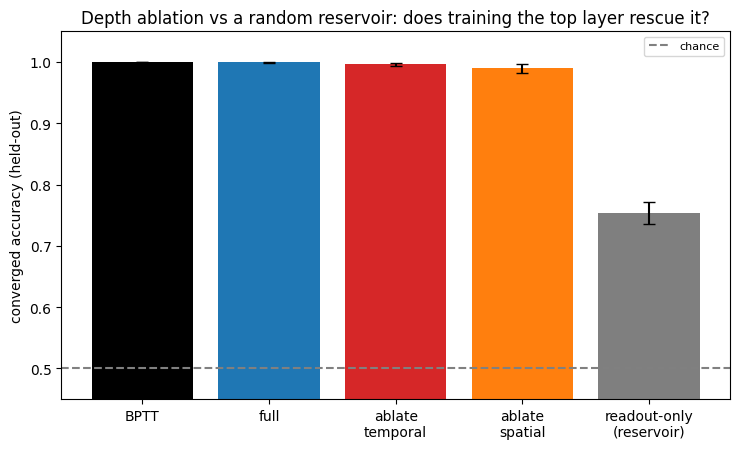

# Technical Note - Deep e-prop: Online Credit Assignment in Deep Recurrent Networks

**NeuroAI & ML 4 Neuro - Sommersemester 2026**
**Authors:** Simon Peter, Yannick Säckl, Ruchit Kumar Patel

> This note summarizes the method, main results, and limitations. The full mathematical derivation and its numerical
> verification against the code, can be found in [`docs/mathematical_note.md`](docs/mathematical_note.md).

---

## 1. Motivation and question

E-prop (Bellec et al. 2020) is a forward, biologically plausible alternative to
backprop-through-time (BPTT): each synapse maintains a local **eligibility trace** that,
multiplied by a top-down **learning signal**, approximates the true loss gradient. It works
well in *single-layer* recurrent networks. Millidge (2025) extends it to **deep** recurrent
networks, where a lower-layer synapse's credit must reach the readout by travelling both
**up through the layers** (a *spatial/depth* path) and **forward through time** in the
upper layers' recurrence (a *cross-layer temporal* path).

**We ask:** does deep e-prop actually carry credit along *both* paths, and how much does each path matter
 (time vs depth)?

### Hypotheses

**H1: Feasibility.** The deep e-prop recursion performs meaningful credit assignment across
depth: its parameter gradients are positively aligned with the exact BPTT gradient at every
layer, and a network trained with it learns a task that promotes routing credit
through the lower recurrent layer.
- **Prediction:** cos(g_deep-eprop, g_BPTT) > 0 at every layer, held-out accuracy improves with
  training.
- **Null:** the lower-layer gradient is uncorrelated with the true BPTT gradient, or a network
  trained with it does no better than the degenerate floor where both cross-layer traces are
  ablated.

**H2: Attribution (time vs. depth).** The exact BPTT gradient is a sum over paths through the
time × depth lattice; deep e-prop's cross-layer trace
`ε^z = (∂z/∂h)·ε^h + (∂z/∂z_{t−1})·ε^z_{t−1}` carries two additive components. One **spatial**
term (∂z/∂h, the depth path) and a **cross-layer temporal** term (∂z/∂z_{t−1}, the time path).
Zeroing each term in isolation (`ablate_spatial`, `ablate_temporal`) should isolate its
contribution to the lower layer's credit.
- **Prediction:** `ablate_spatial` removes the only route into the lower-layer gradient, so it
  should collapse to *exactly* zero; `ablate_temporal` should leave a small residual gradient
  from the current time step alone, with lower cosine to BPTT than the full rule. 
- **Null:** the two ablations leave the lower-layer gradient materially unchanged from full.

## 2. Method

### 2.1 Feasibility check: single-layer non-spiking reproduction of Bellec et al.
**Model.** A single-layer leaky-integrator RNN (`models/leaky_rnn.py`):
`h_t = (1−α)·h_{t−1} + α·tanh(W_rec·h_{t−1} + W_in·x_t)`, with a linear readout over the recall
window (n_rec = 100, α = 0.005 → memory horizon τ ≈ 200 steps). This is the non-spiking analogue of
Bellec et al.'s single-layer LSNN; using leaky-tanh units instead of spikes removes spiking dynamics
as a confound before we add depth.

**Task: cue accumulation.** The population-coded ("Poisson") evidence-accumulation task of Bellec et
al. (2020) (`tasks/cue_accumulation.py`, `generate_poisson_batch`): a stream of brief left/right cue
pulses separated by silence, then a silent delay, then a recall step at which the network reports
which side received the strict majority of cues.

| Rule | What it does |
|---|---|
| **BPTT** | exact autograd (ground truth) |
| **e-prop** | forward-mode approximation |

**Evaluation.**
Eligibility-trace approximation transfers to RNNs: gradient direction tracks BPTT, trains to comparable accuracy. Serves as a sound baseline; removes spiking as a confound for depth.

**Results.**

### 2.2 Main experiment: hierarchical cue accumulation

**Model.** A two-layer leaky-integrator RNN (`models/deep_rnn.py`):
`hˡ_t = (1−αˡ)·hˡ_{t−1} + αˡ·tanh(aˡ_t)`, with per-layer rates α = [0.5, 0.05] (fast lower,
slow top; top memory horizon τ ≈ 20 steps), n_rec = 32, linear readout from the top layer.
The leak is essential: it gives e-prop a real temporal carry to capture. In a vanilla
tanh RNN that carry is ≈ 0.005 and e-prop collapses onto the memoryless d=0 baseline.

**Task: hierarchical "classify-then-count"** (`tasks/hierarchical_cue.py`). Each trial
shows several short temporal **motifs** (mean-zero *rising* vs *falling* ramps with identical
mean and energy, differing only in the sign of their time-derivative), separated by silence,
then a long silent **delay**, then one **decision** step asking for the majority motif class.
We constructed the toy task with these goals in mind:
- *Classify (depth):* mean-zero motifs force the **lower** layer to learn a genuine temporal
  feature detector so that a frozen random layer cannot fake it.
- *Count (time):* the top layer must accumulate per-motif classifications and hold them
  across the delay, so credit for an early motif must cross both depth and time.

Our reservoir control (Result 5, §4) later showed that this task does not *force* depth to be used, since
a frozen random lower layer already exposes the per-motif feature linearly. This means depth credit is used
but not strictly required here. We report this openly as a limitation.

**Learning rules compared** (all share the same forward model; only the gradient differs):

| Rule | What it does |
|---|---|
| **BPTT** | exact autograd (ground truth) |
| **full deep e-prop** | full cross-layer trace `ε^z` (spatial seed + temporal carry) |
| **ablate_spatial** | set ∂z/∂h = 0 → removes the **depth** path |
| **ablate_temporal** | set ∂z/∂z_{t−1} = 0 → removes the **cross-layer temporal** path |
| **readout-only reservoir** | freeze both recurrent layers, train only the linear readout |

**Evaluation.** (E1) per-parameter **gradient cosine** to BPTT, and the fraction of
lower-layer credit carried by the temporal path; (E2) **learning curves** to convergence;
(E3) a **delay sweep**. Uncertainty is reported as SEM across seeds

## 3. Main results

**Result 1: deep e-prop assigns meaningful, BPTT-aligned credit across both time and depth.**
Full deep e-prop matches BPTT gradients for both layers (lower/input-adjacent cosine
≈ 0.73–0.79, top/output-adjacent ≈ 0.92–0.96), staying positive at every layer and every
delay. This answers **Q1: yes**. the deep recursion carries real credit through the lower
recurrent layer. Of that lower-layer credit, the cross-layer **temporal** trace carries
≈ **93%** of the magnitude, so the depth credit is dominated by the temporal path
(**Q2: temporal dominates**).

*Figure 2.2 Per-layer gradient cosine to BPTT and cross-temporal credit share vs delay. (`results/main_results/exp2.2_gradient_credit.{svg,pdf,png}`, `notebooks/main_results.ipynb` §2.2)*

**Result 2: the two ablations behave exactly as the credit-path picture predicts.**
`ablate_spatial` zeroes the lower-layer gradient *exactly* (the depth path is the only
injection into `ε^z`); `ablate_temporal` retains **most of the gradient alignment** with BPTT.
Both leave the **top layer and readout gradients bit-for-bit identical to full**, because the
ablations act only on the lower-layer cross-trace.

*Figure 2.4 Lower- vs top-layer gradient cosine at D=12 for full and both ablations. (`results/main_results/exp2.4_credit_summary.{svg,pdf,png}`, `notebooks/main_results.ipynb` §2.4)*

**Result 3: spatial carry makes gradients *travel*; temporal carry makes them *meaningful*.**
Although `ablate_temporal` keeps most of the raw cosine to BPTT, the lower-layer gradients it
produces become **cue-agnostic**: a linear decoder recovers the readout-sign / binary label
from them near-perfectly under both full and `ablate_temporal`, but the *cue margin*
(unanimous vs. split) decodes at ≈ 0.84 for full and only ≈ 0.68 for `ablate_temporal`,
while `ablate_spatial` sits at chance (≈ 0.50). So the **spatial** term is what lets any
gradient reach the lower layer, and the **temporal** term is what makes that gradient carry
task-relevant information.

*Figure 2.5  Cross-validated decode accuracy of lower-layer gradients (binary label vs. cue margin) for full and both ablations. (`results/main_results/exp2.5_cue_decoding.{svg,pdf,png}`, `notebooks/main_results.ipynb` §2.5)*

The same result, distilled into a single "cue-margin decoding ladder": full deep e-prop sits at the
top (cue margin recoverable), `ablate_temporal` drops in the middle (gradient still reaches the lower
layer but is cue-agnostic), and `ablate_spatial` falls to chance (no gradient reaches the lower layer
at all).

*Figure 2.5b Cue-margin decoding ladder: lower-layer cue-margin decodability for full deep e-prop and both ablations. (`results/main_results/exp2.5_cue_decoding_ladder.{svg,pdf,png}`, `notebooks/main_results.ipynb` §2.5)*

**Result 4: the credit-quality difference shows up as convergence speed.**
Under Adam all trainable rules eventually reach ≈ 1.0 held-out accuracy, so the credit-quality
difference appears as **convergence speed**. Steps to reach ≥ 0.90 accuracy order as
**BPTT (≈ 95) < full deep e-prop (≈ 256) < ablate_temporal (≈ 473) ≈ ablate_spatial (≈ 458)**:
full is significantly faster than either ablation (`*`), while the two ablations are
statistically indistinguishable from each other (`ns`). Deep e-prop works, but removing either
cross-layer component slows learning to a comparable degree.

*Figure 2.1  Learning curves at D=12 (mean ± SEM across seeds). (`results/main_results/exp2.1_learning_curves.{svg,pdf,png}`, `notebooks/main_results.ipynb` §2.1)*

**Result 5: depth is not required on this task (reservoir control).**
A frozen random lower layer with only the top layer and readout trained reaches ≈ 100%
accuracy and is statistically indistinguishable from full deep e-prop (Δ ≈ 0.000, permutation
p ≈ 1.0). The per-cue rising/falling feature is already linearly present in the untrained
lower layer, so depth credit is *used but not necessary* here.

*Figure 2.6 Random-reservoir (frozen lower layer) vs trainable rules. (`results/main_results/exp2.6_reservoir_control.{svg,pdf,png}`, `notebooks/main_results.ipynb` §2.6)*

## 4. Limitations

- **Depth is used but not *necessary* on this task.** A frozen random lower layer with only
  the top layer and readout trained reaches ≈ 100% accuracy, statistically indistinguishable
  from full deep e-prop (reservoir effect; Result 5). Under Adam a trained top reading a
  *random* lower layer also nearly solves it (`ablate_spatial` ≈ 0.996 final accuracy). So
  zeroing all lower-layer credit barely hurts *final* accuracy here. The top recurrent layer
  reconstructs the temporal feature itself, and depth credit only **speeds convergence** (both
  ablations are slower) rather than being required. Making depth use *inevitable* would need a
  harder task with capacity/routing constraints that a frozen lower layer cannot fake (cf.
  `tasks/routed_cue.py`, `experiments/pilot_reservoir_resistance.py`). The reservoir control is
  exactly the instrument that exposes this caveat.
- **Diagonal approximation.** E-prop's only approximation is replacing the recurrent
  Jacobian with its diagonal; the residual cosine gap to BPTT (top ≈ 0.93, lower ≈ 0.72)
  grows with recurrence strength and delay, as expected. When the approximation is made
  exact (zero recurrence), deep e-prop matches BPTT to float32 precision (≈ 1e-9).

## 5. Reproducing the figures

| Figure | File in `results/` | Command |
|---|---|---|
| Fig 1.1 learning curves single layer | `main_results/exp1.1_learning_curves.{png,svg,pdf}` | `notebooks/main_results.ipynb` §1.1 |
| Fig 1.2 single layer speed threshold | `main_results/exp1.2_speed_threshold.{png,svg,pdf}` | `notebooks/main_results.ipynb` §1.2 |
| Fig 1.3 single layer delay sweep | `main_results/exp1.3_delay_sweep.{png,svg,pdf}` | `notebooks/main_results.ipynb` §1.3 |
| Fig 2.1 learning curves | `main_results/exp2.1_learning_curves.{svg,pdf}` | `notebooks/main_results.ipynb` §2.1 |
| Fig 2.2 gradient credit | `main_results/exp2.2_gradient_credit.{svg,pdf}` | `notebooks/main_results.ipynb` §2.2 |
| Fig 2.3 speed threshold | `main_results/exp2.3_speed_threshold.{svg,pdf}` | `notebooks/main_results.ipynb` §2.3 |
| Fig 2.4 credit summary | `main_results/exp2.4_credit_summary.{svg,pdf}` | `notebooks/main_results.ipynb` §2.4 |
| Fig 2.5 cue decoding | `main_results/exp2.5_cue_decoding.{svg,pdf}` | `notebooks/main_results.ipynb` §2.5 |
| Fig 2.5b cue-margin decoding ladder | `main_results/exp2.5_cue_decoding_ladder.{svg,pdf}` | `notebooks/main_results.ipynb` §2.5 |
| Fig 2.6 reservoir control | `main_results/exp2.6_reservoir_control.{svg,pdf}` | `notebooks/main_results.ipynb` §2.6 |
